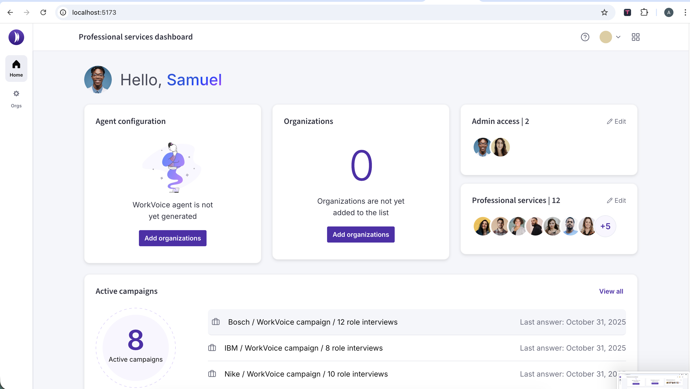
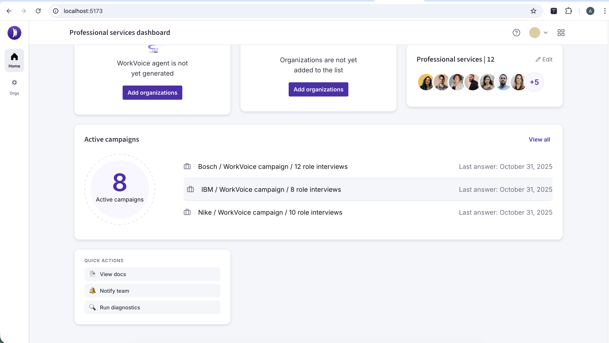
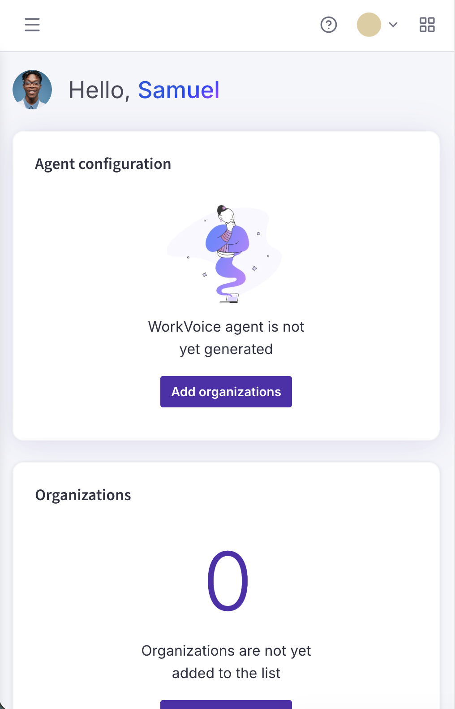
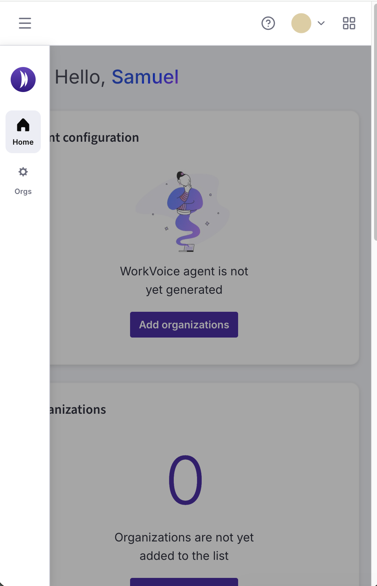
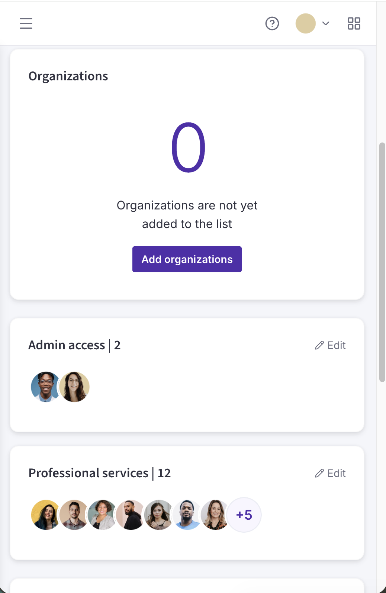
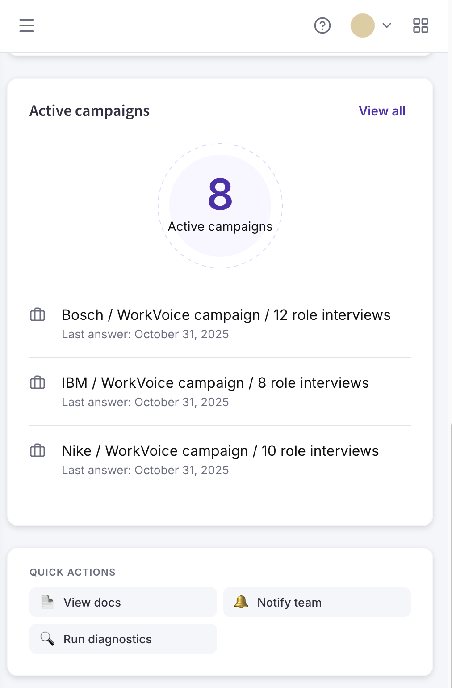

# WorkVoice Dashboard

A React application recreating the **"Agent configuration"** widget from the *Professional Services Dashboard* Figma prototype.

---

## Quick Start

```bash
# 1. Install dependencies
npm install
npm install @testing-library/dom --legacy-peer-deps

If you encounter peer dependency conflicts when running `npm install`, re-run the install with:

```bash
npm install --legacy-peer-deps
```

# 2. Run dev server
npm run dev
# → http://localhost:5173

# 3. Run tests
npm test
# WorkVoice Dashboard

A small React + TypeScript app demonstrating an "Agent configuration" widget.

## Setup

Install dependencies:

```bash
npm install
# If you encounter peer dependency conflicts, re-run:
npm install --legacy-peer-deps
```

Install optional testing helpers:

```bash
npm install @testing-library/dom --legacy-peer-deps
```

## Run (development)

```bash
npm run dev
# open http://localhost:5173
```

## Test

```bash
npm test
# Run a single test file:
npx vitest run src/test/AgentConfigWidget.test.tsx
```

## Build / Preview

```bash
npm run build
npm run preview
```

## Lint & Format

```bash
npm run lint
npm run format
```

## Architecture (brief)

- Single-page React app built with Vite and TypeScript.
- UI is component-driven; the main focus is `src/components/dashboard/AgentConfigWidget.tsx`.
- All data comes from `src/data/mockData.ts` which simulates an async fetch using `setTimeout`.
- Styling uses CSS Modules and design tokens defined in `src/index.css`.

Project structure (high-signal files)

- App entry: [src/main.tsx](src/main.tsx)
- Root component: [src/App.tsx](src/App.tsx)
- Main widget: [src/components/dashboard/AgentConfigWidget.tsx](src/components/dashboard/AgentConfigWidget.tsx)
- Mock data: [src/data/mockData.ts](src/data/mockData.ts)
- Types: [src/types/index.ts](src/types/index.ts)
- Tests: [src/test/AgentConfigWidget.test.tsx](src/test/AgentConfigWidget.test.tsx)

## Technology

- React
- TypeScript
- Vite
- Vitest + @testing-library/react
- ESLint, Prettier
- CSS Modules

## Deployment & Screenshots (optional)









## AI Tools

- Tools used: Claude (Anthropic).

---
